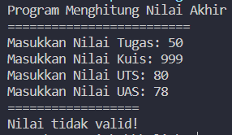
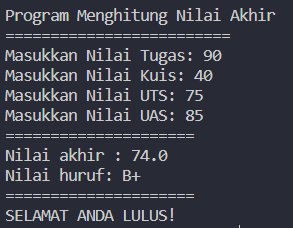
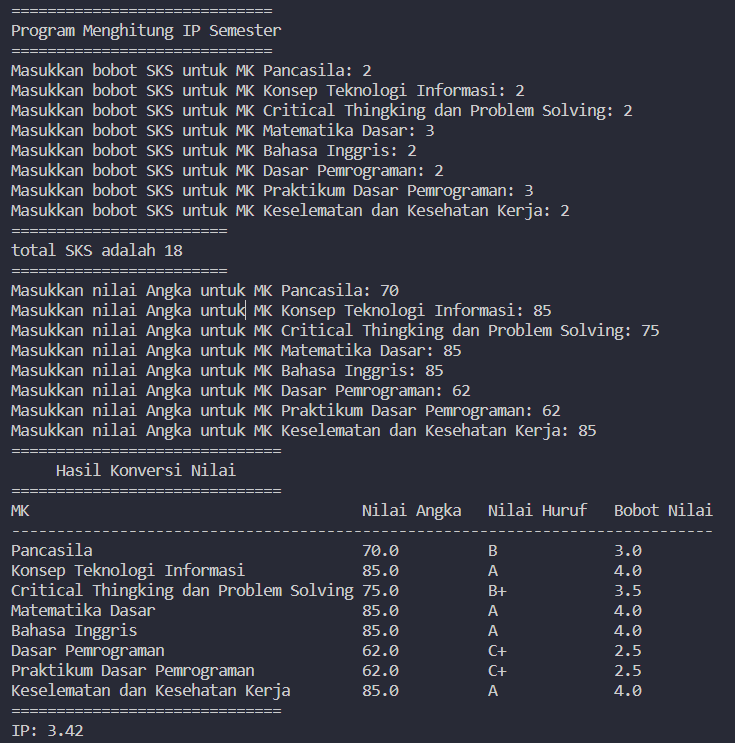
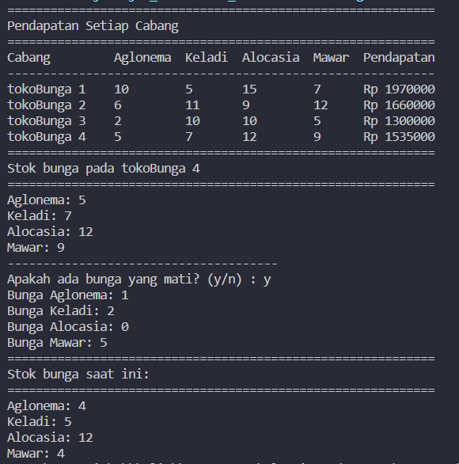
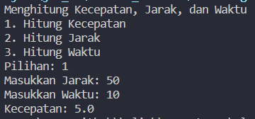
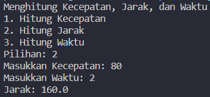
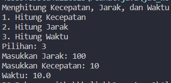

# Week 01 - JOBSHEET 1 - KONSEP DASAR PEMROGRAMAN 

**Nama :** Mohammad Adri Favian<br>
**NIM :** 2341720185<br>
**Kelas :** TI-1B<br>
**Absen :** 18

## Praktikum

### Pemilihan
Jawablah pertanyaan-pertanyaan yang ada berikut ini : 

#### 2.2.1 Praktikum Pemilihan
***Pertanyaan***
1. Buatlah program untuk menghitung nilai akhir dari mahasiswa dengan ketentuan 20% nilai
tugas, 20% dari nilai kuis, 30% nilai UTS, dan 30% nilai UAS. Setiap nilai yang dimasukkan
mempunyai batas nilai 0 ‐ 100. Ketika pengguna memasukkan diluar rentang tersebut maka
akan keluar output “nilai tidak valid”. Ketika nilai akhir sudah didapatkan selanjutnya
lakukan konversi nilai dengan ketentuan seperti yang diberikan pada soal.

Jika Nilai Huruf yang didapatkan adalah A,B+,B+C+,C maka LULUS, jika nilai huruf D dan E
maka TIDAK LULUS.

code `Pemilihan18.java`:

```java
import java.util.Scanner;
public class Pemilihan18 {
    public static void main(String[] args) {
        Scanner sc = new Scanner(System.in);
        System.out.println("Program Menghitung Nilai Akhir");
        System.out.println("=========================");
        System.out.print("Masukkan Nilai Tugas: ");
        int nilaiTugas = sc.nextInt();
        System.out.print("Masukkan Nilai Kuis: ");
        int nilaiKuis = sc.nextInt();
        System.out.print("Masukkan Nilai UTS: ");
        int nilaiUTS = sc.nextInt();
        System.out.print("Masukkan Nilai UAS: ");
        int nilaiUAS = sc.nextInt();

        if (nilaiTugas < 0 || nilaiTugas > 100 ||
            nilaiKuis < 0 || nilaiKuis > 100 ||
            nilaiUTS < 0 || nilaiUTS > 100 ||
            nilaiUAS < 0 || nilaiUAS > 100) {
            System.out.println("==================");
            System.out.println("Nilai tidak valid!");
            return;
        }
        
        double nilaiAkhir = (0.2 * nilaiTugas) + (0.2 * nilaiKuis) + (0.3 * nilaiUTS) + (0.3 * nilaiUAS);
        
        String nilaiHuruf;
        if (nilaiAkhir > 80) {
            nilaiHuruf = "A";
        } else if (nilaiAkhir > 73) {
            nilaiHuruf = "B+";
        } else if (nilaiAkhir > 65) {
            nilaiHuruf = "B";
        } else if (nilaiAkhir > 60) {
            nilaiHuruf = "C+";
        } else if (nilaiAkhir > 50) {
            nilaiHuruf = "C";
        } else if (nilaiAkhir > 39) {
            nilaiHuruf = "D";
        } else {
            nilaiHuruf = "E";
        }

        System.out.println("=====================");
        System.out.println("Nilai akhir : " + nilaiAkhir);
        System.out.println("Nilai huruf: " + nilaiHuruf);
        System.out.println("=====================");

        if (nilaiHuruf.equals("D") || nilaiHuruf.equals("E")) {
            System.out.println("MAAF ANDA TIDAK LULUS!");
        } else {
            System.out.println("SELAMAT ANDA LULUS!");
        }
    }
}
```

Hasil run program `Pemilihan18.java`:

**nilai tidak valid**



**nilai valid**




### Perulangan
Jawablah pertanyaan-pertanyaan yang ada berikut ini :

#### 2.2.1 Praktikum Pemilihan
***Pertanyaan***

1. Buatlah program yang dapat menampilkan deretan bilangan dari angka 1 sampai n kecuali
angka 6 dan 10, angka ganjil dicetak dengan asterik “*”, angka genap dicetak sesuai bilangan
aslinya, dengan n = 2 digit terakhir NIM anda.
*bila n<10 maka tambahkan 10 (n+=10)

code `Perulangan18.java`

```java
import java.util.Scanner;
public class Perulangan18 {
    public static void main(String[] args) {
        Scanner sc = new Scanner(System.in);
        System.out.print("Masukkan NIM: ");
        long nim = sc.nextLong();
        System.out.println("=======================");
        //  2 digit terakhir dari NIM
        long n = nim%100;
        
        if (n < 10) {
            n += 10;
        }

        System.out.println("n : "+n);

        for (int i = 1; i <= n; i++) {
            if (i == 6 || i == 10) {
                continue; 
            }
            if (i % 2 == 0) {
                System.out.print(i);
            } else {
                System.out.print("*");
            }
        }
    }
}
```

Hasil run program `Perulangan18.java`:

**NIM: 2341720185**


**NIM: 2341720102**


### Array
Jawablah pertanyaan-pertanyaan yang ada berikut ini :

#### 2.4.1 Praktikum Array
***Pertanyaan***

1. Buatlah program untuk menghitung IP Semester dari matakuliah yang Anda tempuh
semester lalu. Formula untuk menghitung IP semester sebagai berikut :

$IP Semester = \frac{\sum(Nilai setara * bobot SKS)}{\sum SKS}$
Kemudian dikonversi sesuai perintah yang tertera pada soal!

Input dari program berupa nama matakuliah, bobot SKS, serta nilai huruf dari matakuliah
tersebut.

code `Array18.java`

```java
import java.util.Scanner;
public class Array18 {
    public static void main(String[] args) {
        Scanner sc = new Scanner(System.in);
        String[] MK = {"Pancasila", "Konsep Teknologi Informasi", "Critical Thingking dan Problem Solving", 
                        "Matematika Dasar", "Bahasa Inggris", "Dasar Pemrograman", "Praktikum Dasar Pemrograman",
                        "Keselematan dan Kesehatan Kerja"}; 
        double[] nilaiAngka = new double[MK.length];
        int[] bobotSKS = new int[MK.length];
        String[] nilaiHuruf = new String[nilaiAngka.length];
        double[] nilaiSetara = new double[nilaiAngka.length];
        
        System.out.println("=============================");
        System.out.println("Program Menghitung IP Semester");
        System.out.println("=============================");
        
        //input SKS MK
        for (int i = 0; i < MK.length; i++) {
            System.out.print("Masukkan bobot SKS untuk MK " + MK[i] + ": ");
            bobotSKS[i] = sc.nextInt();
        }
        
        //totalSKS
        int totalSKS = 0;
        for (int i=0; i < bobotSKS.length; i++) {
            totalSKS += bobotSKS[i];
        }
        System.out.println("========================");
        System.out.print("total SKS adalah " + totalSKS +"\n");
        System.out.println("========================");

        //input nilai MK
        for (int i = 0; i < MK.length; i++) {
            System.out.print("Masukkan nilai Angka untuk MK " + MK[i] + ": ");
            nilaiAngka[i] = sc.nextInt();
        }

        for (int i=0; i<nilaiAngka.length; i++) {
            if (nilaiAngka[i] > 80) {
                nilaiHuruf[i] = "A";
                nilaiSetara[i] = 4;
            } else if (nilaiAngka[i] > 73) {
                nilaiHuruf[i] = "B+";
                nilaiSetara[i] = 3.5;
            } else if (nilaiAngka[i] > 65) {
                nilaiHuruf[i] = "B";
                nilaiSetara[i] = 3;
            } else if (nilaiAngka[i] > 60) {
                nilaiHuruf[i] = "C+";
                nilaiSetara[i] = 2.5;
            } else if (nilaiAngka[i] > 50) {
                nilaiHuruf[i] = "C";
                nilaiSetara[i] = 2;
            } else if (nilaiAngka[i] > 39) {
                nilaiHuruf[i] = "D";
                nilaiSetara[i] = 1;
            } else {
                nilaiHuruf[i] = "E";
                nilaiSetara[i] = 0;
            }
        }
        //menghitung IP
        float hasilIP = 0;
        for (int i=0; i<nilaiSetara.length; i++) {
            hasilIP += (nilaiSetara[i] * bobotSKS[i]) / totalSKS;
        }

        System.out.println("==============================");
        System.out.println("     Hasil Konversi Nilai");
        System.out.println("==============================");
        // Menampilkan header tabel
        System.out.printf("%-38s %-13s %-13s %-13s %n", "MK", "Nilai Angka", "Nilai Huruf", "Bobot Nilai");
        System.out.println("------------------------------------------------------------------------------");
        
        // Menampilkan data dalam bentuk tabel
        for (int j = 0; j < MK.length; j++) {
            System.out.printf("%-38s %-13s %-13s %-13s %n", MK[j], nilaiAngka[j], nilaiHuruf[j], nilaiSetara[j]);
        }

        System.out.println("==============================");
        //format untuk membulatkan hasil
        String hasilFormat = String.format("%.2f",hasilIP);
        System.out.println("IP: "+ hasilFormat);
    sc.close();
    }
}
```

**note**: terdapat sedikit perubahan yang saya lakukan, seperti memasukkan SKS manual, tampilan hasil konversi nilai berupa tabel.

Hasil run program `Array18.java`:



### Fungsi
Jawablah pertanyaan-pertanyaan yang ada berikut ini :

#### 2.5.1 Praktikum Array
***Pertanyaan***

RoyalGarden adalah toko bunga yang memiliki banyak cabang. Setiap hari Stock Bunga dan bungabunga yang dijual selalu dicatat.
1. Buatlah fungsi untuk menampilkan pendapatan setiap cabang jika semua bunga habis
terjual.
2. Buatlah fungsi untuk mengetahui jumlah Stock setiap jenis bunga pada cabang royalgarden
4. Jika terdapat informasi tambahan berupa pengurangan stock karena bunga tersebut mati.
Dengan rincian Aglonema -1, Keladi -2, Alocasia -0, Mawar -5.

code `Fungsi18`:

```java
import java.util.Scanner;
public class Fungsi18 {
    static Scanner sc = new Scanner(System.in);
    static int[][] tokoBunga = {
        {10, 5, 15, 7},
        {6, 11, 9, 12},
        {2, 10, 10, 5},
        {5, 7, 12, 9}
    };
    static String[] namaBunga = {"Aglonema", "Keladi", "Alocasia", "Mawar"};
    public static void main(String[] args) {
        pendapatan();
        updateStock(4);
        sc.close();
    }

    static void pendapatan() {
        System.out.println("============================================================");
        System.out.println("Pendapatan Setiap Cabang");
        System.out.println("============================================================");
        System.out.printf("%-14s %-9s %-7s %-9s %-6s %-20s\n", "Cabang", "Aglonema", "Keladi", "Alocasia", "Mawar", "Pendapatan");
        System.out.println("------------------------------------------------------------");

        for (int i=0; i< tokoBunga.length; i++) {
            int pendapatan = tokoBunga[i][0] * 75000
                           + tokoBunga[i][1] * 50000
                           + tokoBunga[i][2] * 60000
                           + tokoBunga[i][3] * 10000;
        
            System.out.printf("%-14s %-9s %-7s %-9s %-6s %-10s \n", "tokoBunga " + (i + 1),
                tokoBunga[i][0], tokoBunga[i][1], tokoBunga[i][2], tokoBunga[i][3],
                "Rp " + pendapatan);
        }
        
    }

    static void updateStock(int cabang) {
        int index = cabang - 1;

        System.out.println("============================================================");
        System.out.println("Stok bunga pada tokoBunga " + cabang) ;
        System.out.println("============================================================");
        
        for (int i = 0; i < tokoBunga[3].length; i++) {
            System.out.println(namaBunga[i] + ": " + tokoBunga[3][i]);
        }

        System.out.println("--------------------------------------");
        System.out.print("Apakah ada bunga yang mati? (y/n) : ");
        String pilihan = sc.next();

        if (pilihan.equalsIgnoreCase("y")) {
            int[] penguranganBunga = new int[4];

            for (int i=0; i < namaBunga.length; i++) {
                System.out.print("Bunga " + namaBunga[i] + ": ");
                penguranganBunga[i] = sc.nextInt();
            }

            System.out.println("============================================================");
            System.out.println("Stok bunga saat ini: ");
            System.out.println("============================================================");

            for (int i = 0; i < namaBunga.length; i++) {
                int stokSetelahPengurangan = tokoBunga[index][i] - penguranganBunga[i];
                System.out.println(namaBunga[i] + ": " + stokSetelahPengurangan);
            }
        }
    }
}
```

Hasil Percobaan:



### Tugas

1. Membuat program menemukan kode plat mobil

code `Tugas1`:

```java
import java.util.Scanner;
public class Tugas1 {
    public static void main(String[] args) {
        Scanner sc = new Scanner(System.in);
        char[] KODE = {'A', 'B', 'D', 'E', 'F', 'G', 'H', 'L', 'N', 'T'};

        char[][] KOTA = {
                {'B', 'A', 'N', 'T', 'E', 'N'},
                {'J', 'A', 'K', 'A', 'R', 'T', 'A'},
                {'B', 'A', 'N', 'D', 'U', 'N', 'G'},
                {'C', 'I', 'R', 'E', 'B', 'O', 'N'},
                {'B', 'O', 'G', 'O', 'R'},
                {'P', 'E', 'K', 'A', 'L', 'O', 'N', 'G', 'A', 'N'},
                {'S', 'E', 'M', 'A', 'R', 'A', 'N', 'G'},
                {'S', 'U', 'R', 'A', 'B', 'A', 'Y', 'A'},
                {'M', 'A', 'L', 'A', 'N', 'G'},
                {'T', 'E', 'G', 'A', 'L'}
        };

        boolean found = false;

        while (!found) {
            System.out.print("Masukkan kode plat nomor : ");
            char kodePlat = sc.next().toUpperCase().charAt(0);

            for (int i=0; i < KODE.length; i++) {
                if (KODE[i] == kodePlat) {
                    for (int j=0; j < KOTA[i].length; j++) {
                        System.out.print(KOTA[i][j]);
                    }
                    found = true;
                    break;
                }
            }

            if (!found) {
                System.out.println("Kode plat nomor tidak ditemukan, silahkan coba lagi !");
            }
        }sc.close();
    }
}
```

Hasil percobaan `Tugas1`:


2. Membuat program untuk menghitung rumus kecepatan, jarak, dan waktu dengan memiliki fungsi sebagai berikut:</br>
a. Menu untuk memilih rumus yang akan dihitung (kecepatan/jarak/waktu)</br>
b. Menghitung hasil perhitungan Kecepatan</br>
c. Menghitung hasil perhitungan Jarak</br>
d. Menghitung hasil perhitungan Waktu

code `Tugas2`:

```java
import java.util.Scanner;
public class Tugas2 {
    static Scanner sc = new Scanner(System.in);

    static double s,t,v;
    
    public static void main(String[] args) {
        menuUtama();
    }

    private static void menuUtama() {
        System.out.println("Menghitung Kecepatan, Jarak, dan Waktu");
        System.out.println("1. Hitung Kecepatan");
        System.out.println("2. Hitung Jarak");
        System.out.println("3. Hitung Waktu");
        System.out.print("Pilihan: ");
        
        int pilihan = sc.nextInt();

        switch (pilihan) {
            case 1:
                hitungKecepatan();
                break;

            case 2:
                hitungJarak();
                break;

            case 3:
                hitungWaktu();
                break;

            default:
                System.out.println("Pilihan tidak valid!");
        }
    }

    private static void hitungKecepatan() {
        System.out.print("Masukkan Jarak: ");
        s = sc.nextDouble();
        System.out.print("Masukkan Waktu: ");
        t = sc.nextDouble();
        System.out.println("Kecepatan: " + getKecepatan(s, t));
    }

    private static void hitungJarak() {
        System.out.print("Masukkan Kecepatan: ");
        v = sc.nextDouble();
        System.out.print("Masukkan Waktu: ");
        t = sc.nextDouble();
        System.out.println("Jarak: " + getJarak(v, t));
    }

    private static void hitungWaktu() {
        System.out.print("Masukkan Jarak: ");
        s = sc.nextDouble();
        System.out.print("Masukkan Kecepatan: ");
        v = sc.nextDouble();
        System.out.println("Waktu: " + getWaktu(s, v));
    }

    private static double getKecepatan(double s, double t) {
        return s / t;
    }

    private static double getJarak(double v, double t) {
        return v * t;
    }

    private static double getWaktu(double s, double v) {
        return s / v;
    }
}
```

Hasil percobaan `Tugas2`:</br>
`Kecepatan`

</br>
`Jarak`

</br>
`Waktu`


