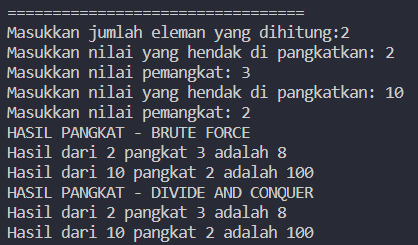
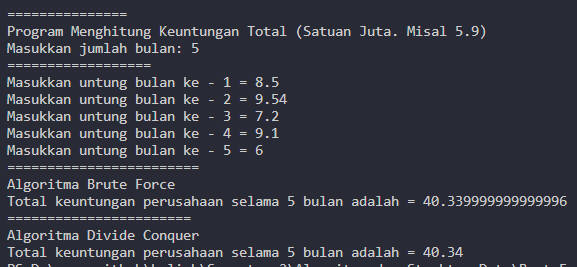
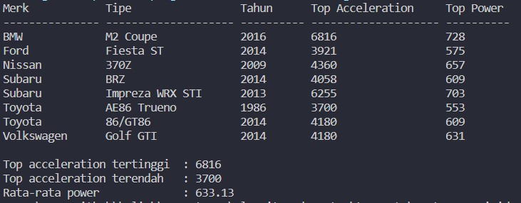

# Week 05 - JOBSHEET 4 - BRUTE FORCE DAN DIVIDE CONQUER

**Nama :** Mohammad Adri Favian<br>
**NIM :** 2341720185<br>
**Kelas :** TI-1B<br>
**Absen :** 18

---
## Menghitung Nilai Faktorial dengan Algoritma Brute Force dan Divide and Conquer

### Langkah-langkah Percobaan

`Faktorial.java`

```java
    public class Faktorial {
        public int nilai;
        
        int faktorialBF(int n){
            int fakto = 1;
            for (int i = 1; i <= n; i++){
                fakto = fakto * i;
            }
            return fakto; 
        }

        int faktorialDC(int n){
            if (n==1) {
                return 1;
            }
            else{
                int fakto = n * faktorialDC(n-1);
                return fakto; 
            }
        }
    }
```

`MainFaktorial.java`

```java
import java.util.Scanner;
public class MainFaktorial {
    public static void main(String[] args) {
        Scanner sc = new Scanner(System.in);
        System.out.println("--------------");
        System.err.print("Masukkan jumlah elemen: ");
        int iJml = sc.nextInt();

        Faktorial[] fk = new Faktorial[10];
        for (int i = 0; i < iJml; i++){
            fk[i]=new Faktorial();
            System.out.print("Masukkan nilai data ke-"+(i+1)+": ");
            fk[i].nilai = sc.nextInt();
        }

        System.out.println("HASIL - BRUTE FORCE");
        for (int i=0; i < iJml;i++) {
            System.out.println("Hasil penghitungan faktorial menggunakan Brute Force adalah " 
                + fk[i].faktorialBF(fk[i].nilai));
            }
            System.out.println("HASIL - DIVIDE n CONQUER");
            for(int i=0;i<iJml;i++){
                System.out.println("Hasil penghitungan faktorial menggunakan Divide n Conquer adalah "
                + fk[i].faktorialDC(fk[i].nilai));
        }
    }
}
```

### Verifikasi Hasil Percobaan


### Pertanyaan
1. Pada base line Algoritma Divide Conquer untuk melakukan pencarian nilai faktorial, jelaskan
perbedaan bagian kode pada penggunaan if dan else!</br>
    Jawab: 
    - Bagian if: ketika n == 1, fungsi return nilai 1 dikarenakan faktorial dari 1 adalah 1. Mencegah rekursi belanjut tak terbatas
    - Bagian else: kondisi n != 1. Fungsi memanggil dirinya sendiri dengan nilai 1, lalu hasil rekursif dikalikan dengan n saat ini. Mengikuti definisi faktorial secara matematis, di mana n! = n * (n-1)!.

2. Apakah memungkinkan perulangan pada method faktorialBF() dirubah selain menggunakan
for?Buktikan!</br>
    Jawab: Iya bisa, contoh penggunaan perulangan *while*:

    ```java
    //while loop
    int faktorialBF(int n) { 
    int fakto = 1;
    int i = 1;  
    while (i <= n) {
        fakto *= i;
        i++;
    }
    return fakto;
    }
    ```

    penggunaan perulangan *while* menghasilkan output yang sama

3. Jelaskan perbedaan antara ```fakto *= i;``` dan ```int fakto = n * faktorialDC(n-1);``` !
    </br>Jawab:
    - fakto *= i; :  digunakan dalam metode Brute Force. `fakto` dikalikan dengan `i`. 
    - int fakto = n * faktorialDC(n-1); :  digunakan dalam metode Divide and Conquer. Melakukan fungsi rekursif dengan memanggil dirinya sendiri memakai argumen `n-1`
    - Perbedaan: Sama-sama menghitung faktorial dari `n`, dengan cara berbeda: 1.iteratif, 2.rekursif
---
## Menghitung Hasil Pangkat dengan Algoritma Brute Force dan Divide and Conquer

## Langkah-langkah Percobaan

`Pangkat.java`

```java
public class Pangkat {
    public int nilai,pangkat;

    int PangkatBF(int a, int n){
        int hasil = 1;
        for(int i=0; i<n; i++){
            hasil *= a;
        }
        return hasil;
    }

    int PangkatDC(int a, int n){
        if(n==1){
            return a;
        }else {
            if(n%2==1) {//bil ganjil
                return (PangkatDC(a,n/2)*PangkatDC(a,n/2)*a);
            }else{
                return (PangkatDC(a,n/2)*PangkatDC(a,n/2));
            }
        }
    }
}
```

`MainPangkat.java`

```java
import java.util.Scanner;
public class MainPangkat {

    public static void main(String[] args) {
        Scanner sc = new Scanner(System.in);
        System.out.println("=================================");
        System.out.print("Masukkan jumlah eleman yang dihitung:");
        int elemen = sc.nextInt();

        Pangkat[] png = new Pangkat[elemen];
        for (int i = 0; i < elemen; i++) {
            png[i] = new Pangkat(); 
            System.out.print("Masukkan nilai yang hendak di pangkatkan: ");
            png[i].nilai = sc.nextInt();
            System.out.print("Masukkan nilai pemangkat: ");
            png[i].pangkat = sc.nextInt();
        }

        System.out.println("HASIL PANGKAT - BRUTE FORCE");
        for (int i = 0; i < elemen; i++) {
            System.out.println("Hasil dari " + png[i].nilai + " pangkat "
                    + png[i].pangkat + " adalah "
                    + png[i].PangkatBF(png[i].nilai, png[i].pangkat));
        }

        System.out.println("HASIL PANGKAT - DIVIDE AND CONQUER");
        for (int i = 0; i < elemen; i++) {
            System.out.println("Hasil dari " + png[i].nilai + " pangkat "
                    + png[i].pangkat + " adalah "
                    + png[i].PangkatDC(png[i].nilai, png[i].pangkat));
        }
        sc.close();
        }
}
```

### Verifikasi Hasil Percobaan



### Pertanyaan
1. Jelaskan mengenai perbedaan 2 method yang dibuat yaitu PangkatBF() dan PangkatDC()!</br>
    Jawab:
    - PangkatBF(): Implementasi metode Brute Force untuk menyelesaikan perpangkatan. Mengulang perkalian `a` sebanyak `n`. Sederhana namun kurang efisien untuk nilai `n` yang besar.
    - PangkatDC(): Implementasi metode Divide and Conquer, sehingga cocok untuk nilai `n` yang besar. Dengan membagikan masalah menjadi bagian kecil dan diselesaikan secara masing-masing secara rekursif.
2. Apakah tahap combine sudah termasuk dalam kode tersebut?Tunjukkan!</br>
    Jawab:
    tahap combine sudah termasuk dalam kode, pada method `PangkatDC()`

    ```java
    if(n%2==1) {
        return (PangkatDC(a,n/2)*PangkatDC(a,n/2)*a);
    }else{
        return (PangkatDC(a,n/2)*PangkatDC(a,n/2));
    }
    ```
3. Modifikasi kode program tersebut, anggap proses pengisian atribut dilakukan dengan
konstruktor.</br>
    Jawab:

    ```java
    System.out.print("Masukkan nilai yang hendak dipangkatkan: ");
    int nilai = sc.nextInt();
    System.out.print("Masukkan nilai pemangkat: ");
    int pangkat = sc.nextInt();
    png[i] = new Pangkat(nilai, pangkat);
    ```
4. Tambahkan menu agar salah satu method yang terpilih saja yang akan dijalankan menggunakan
switch-case!</br>
    Jawab: Hasil modifikasi full kode

    ```java
    import java.util.Scanner;

    public class Pangkat {
        public int nilai,pangkat;

        Pangkat(int a, int n){
            nilai = a;
            pangkat = n;
        }

        int PangkatBF(int a, int n){
            int hasil = 1;
            for(int i=0; i<n; i++){
                hasil *= a;
            }
            return hasil;
        }

        int PangkatDC(int a, int n){
            if(n==1){
                return a;
            }else {
                if(n%2==1)//bil ganjil
                {
                    return (PangkatDC(a,n/2)*PangkatDC(a,n/2)*a);
                }else{
                    return (PangkatDC(a,n/2)*PangkatDC(a,n/2));
                }
            }
        }

        public static void main(String[] args) {
            Scanner sc = new Scanner(System.in);
            System.out.println("=================================");
            System.out.print("Masukkan jumlah eleman yang dihitung:");
            int elemen = sc.nextInt();
            
            Pangkat[] png = new Pangkat[elemen];
            for (int i = 0; i < elemen; i++) {
                System.out.print("Masukkan nilai yang hendak di pangkatkan: ");
                int nilai = sc.nextInt();
                System.out.print("Masukkan nilai pemangkat: ");
                int pangkat = sc.nextInt();
                png[i] = new Pangkat(nilai,pangkat); //input parameter
            }

            System.out.println("\nPilih metode:");
            System.out.println("1. Brute Force");
            System.out.println("2. Divide Conquer");
            System.out.print("Pilihan: ");
            int pilihan = sc.nextInt();
            
            switch (pilihan) { //switch untuk memilih menu
                case 1: 
                    System.out.println("HASIL PANGKAT - BRUTE FORCE");
                    for (int i = 0; i < elemen; i++) {
                        System.out.println("Hasil dari " + png[i].nilai + " pangkat "
                                + png[i].pangkat + " adalah "
                                + png[i].PangkatBF(png[i].nilai, png[i].pangkat));
                    }
                    break;
                case 2:
                    System.out.println("HASIL PANGKAT - DIVIDE AND CONQUER");
                    for (int i = 0; i < elemen; i++) {
                        System.out.println("Hasil dari " + png[i].nilai + " pangkat "
                                + png[i].pangkat + " adalah "
                                + png[i].PangkatDC(png[i].nilai, png[i].pangkat));
                    }   
                    break;
                default:
                    System.out.println("Cek pilihan anda!");
                    break;
            }   
            sc.close();
            }
    }
    ```
---
## Menghitung Sum Array dengan Algoritma Brute Force dan Divide and Conquer

### Langkah-langkah Percobaan

`Sum.java`

```java
import java.text.DecimalFormat;
public class Sum {
    int elemen;
    double keuntungan[], total;

    Sum(int elemen){
        this.elemen = elemen;
        this.keuntungan = new double[elemen];
        this.total = 0;
    }

    double totalBF (double arr[]){
        for(int i=0; i<elemen; i++){
            total = total + arr[i];
        }
        return total;
    }

    double totalDC(double arr[], int l, int r){
        if (l==r) {
            return arr[l];
        }else if(l<r) {
            int mid = (l+r)/2;
            double lsum = totalDC(arr, l, mid);
            double rsum = totalDC(arr, mid+1, r);
            double result = lsum + rsum;
            DecimalFormat df = new DecimalFormat("#.##");
            result = Double.parseDouble(df.format(result));
            return result;
        }
        return 0;
    }
}
```

`MainSum.java`

```java
import java.util.Scanner;
public class MainSum {
    public static void main(String[] args) {
        Scanner sc = new Scanner(System.in);
        System.out.println("===============");
        System.out.println("Program Menghitung Keuntungan Total (Satuan Juta. Misal 5.9)");
        System.out.print("Masukkan jumlah bulan: " );
        int elm = sc.nextInt();

        Sum sm = new Sum(elm);
        System.out.println("==================");
        for (int i = 0; i < sm.elemen; i++) {
            System.out.print("Masukkan untung bulan ke - "+(i+1)+" = ");
            sm.keuntungan[i] = sc.nextDouble();
        }

        System.out.println("========================");
        System.out.println("Algoritma Brute Force");
        System.out.println("Total keuntungan perusahaan selama " + sm.elemen + " bulan adalah = " + sm.totalBF (sm.keuntungan));
        System.out.println("=======================");
        System.out.println("Algoritma Divide Conquer");
        System.out.println("Total keuntungan perusahaan selama " + sm.elemen + " bulan adalah = " + sm.totalDC (sm.keuntungan, 0, sm.elemen-1));
    } 
}
```

### Verifikasi Hasil Percobaan



### Pertanyaan
1. Mengapa terdapat formulasi return value berikut?Jelaskan!</br>
    Jawab:
    Digunakan untuk menggabungkan hasil nilai dari proses DC yang dilakukan sebelumnya. Lalu nilai tersebut dikembalikan dari fungsi rekursif
2. Kenapa dibutuhkan variable mid pada method TotalDC()?</br>
    Jawab:
    Untuk menentukan titik tengah sebagai pembagian sisi kiri dan kanan. Sehingga proses Divide n Conquer dapat dijalankan
3. Program perhitungan keuntungan suatu perusahaan ini hanya untuk satu perusahaan saja.
Bagaimana cara menghitung sekaligus keuntungan beberapa bulan untuk beberapa
perusahaan.(Setiap perusahaan bisa saja memiliki jumlah bulan berbeda-beda)? Buktikan
dengan program!</br>
    Jawab: modifikasi kode pada `MainSum.java`

    ```java
    import java.text.DecimalFormat;
    import java.util.Scanner;
    public class MainSum {
        public static void main(String[] args) {
            Scanner sc = new Scanner(System.in);
            System.out.println("===============");
            System.out.println("Program Menghitung Keuntungan Total (Satuan Juta. Misal 5.9)");
            System.out.print("Masukkan jumlah perusahaan: " );
            int jmlPerusahaan = sc.nextInt();

            for (int p = 0; p < jmlPerusahaan; p++) {
                System.out.println("\nPerusahaan ke-" + (p + 1));
                System.out.print("Masukkan jumlah bulan: ");
                int elm = sc.nextInt();

                Sum sm = new Sum(elm);

                System.out.println("==================");
                for (int i = 0; i < sm.elemen; i++) {
                    System.out.print("Masukkan untung bulan ke-" + (i + 1) + " = ");
                    sm.keuntungan[i] = sc.nextDouble();
                }

                System.out.println("========================");
                System.out.println("Algoritma Brute Force");
                System.out.println("Total keuntungan perusahaan selama " + sm.elemen + " bulan adalah = " + sm.totalBF(sm.keuntungan));
                System.out.println("=======================");
                System.out.println("Algoritma Divide Conquer");
                System.out.println("Total keuntungan perusahaan selama " + sm.elemen + " bulan adalah = " + sm.totalDC(sm.keuntungan, 0, sm.elemen - 1));
            }
        }
    }
    ```

    `Output:`
    ```txt
    ===============
    Program Menghitung Keuntungan Total (Satuan Juta. Misal 5.9)
    Masukkan jumlah perusahaan: 2

    Perusahaan ke-1
    Masukkan jumlah bulan: 1
    ==================
    Masukkan untung bulan ke-1 = 9.4
    ========================
    Algoritma Brute Force
    Total keuntungan perusahaan selama 1 bulan adalah = 9.4
    =======================
    Algoritma Divide Conquer
    Total keuntungan perusahaan selama 1 bulan adalah = 9.4

    Perusahaan ke-2
    Masukkan jumlah bulan: 2
    ==================
    Masukkan untung bulan ke-1 = 4.5
    Masukkan untung bulan ke-2 = 6.0
    ========================
    Algoritma Brute Force
    Total keuntungan perusahaan selama 2 bulan adalah = 10.5
    =======================
    Algoritma Divide Conquer
    Total keuntungan perusahaan selama 2 bulan adalah = 10.5
    ```
---
## Latihan Praktikum

`mobil18.java`

```java
import java.util.ArrayList;

public class mobil18 {
    public String merk;
    public String tipe;
    public int tahun;
    public int topAcceleration, topPower;

    // digunakan di main, menyimpan data ke array 
    public static ArrayList<String[]> semuaDataMobil = new ArrayList<>();

    public mobil18(String merk, String tipe, int tahun, int topAcceleration, int topPower) {
        this.merk = merk;
        this.tipe = tipe;
        this.tahun = tahun;
        this.topAcceleration = topAcceleration;
        this.topPower = topPower;

        semuaDataMobil.add(new String[]{merk, tipe, String.valueOf(tahun), String.valueOf(topAcceleration), String.valueOf(topPower)});
    }

    // method statis untuk operasi Divide n Conquer
    public static int findMaxAccelDC(mobil18[] cars) {
        return maxAccelDC(cars, 0, cars.length - 1);
    }
        private static int maxAccelDC(mobil18[] cars, int l, int r) {
            if (l == r) {
                return cars[l].topAcceleration;
            } else {
                int mid = (l + r) / 2;
                int leftMax = maxAccelDC(cars, l, mid);
                int rightMax = maxAccelDC(cars, mid + 1, r);
                return Math.max(leftMax, rightMax);
            }
        }
        
    // method statis untuk operasi Divide n Conquer
    public static int findMinAccelDC(mobil18[] cars) {
        return minAccelDC(cars, 0, cars.length - 1);
    }
        private static int minAccelDC(mobil18[] cars, int l, int r) {
            if (l == r) {
                return cars[l].topAcceleration;
            } else {
                int mid = (l + r) / 2;
                int leftMin = minAccelDC(cars, l, mid);
                int rightMin = minAccelDC(cars, mid + 1, r);
                return Math.min(leftMin, rightMin);
            }
        }

    public static double rataRataBF(mobil18[] cars) {
        double totalPower = 0;
        for (mobil18 car : cars) {
            totalPower += car.topPower;
        }
        return totalPower / cars.length;
    }
}
```

`MainMobil18.java`

```java
public class MainMobil18 {
    public static void main(String[] args) {
        mobil18[] mobil = {
                new mobil18("BMW", "M2 Coupe", 2016, 6816, 728),
                new mobil18("Ford", "Fiesta ST", 2014, 3921, 575),
                new mobil18("Nissan", "370Z", 2009, 4360, 657),
                new mobil18("Subaru", "BRZ", 2014, 4058, 609),
                new mobil18("Subaru", "Impreza WRX STI", 2013, 6255, 703),
                new mobil18("Toyota", "AE86 Trueno", 1986, 3700, 553),
                new mobil18("Toyota", "86/GT86", 2014, 4180, 609),
                new mobil18("Volkswagen", "Golf GTI", 2014, 4180, 631)
        };

        int maxAccel = mobil18.findMaxAccelDC(mobil);
        int minAccel = mobil18.findMinAccelDC(mobil);
        double rataRata = mobil18.rataRataBF(mobil);

        // print tabel
        System.out.printf("%-15s %-20s %-10s %-20s %-10s%n", "Merk", "Tipe", "Tahun", "Top Acceleration", "Top Power");
        System.out.printf("%-15s %-20s %-10s %-20s %-10s%n", "---------------", "--------------------", "----------", "--------------------", "----------");
        for (String[] dataMobil : mobil18.semuaDataMobil) {
            System.out.printf("%-15s %-20s %-10s %-20s %-10s%n", dataMobil[0], dataMobil[1], dataMobil[2], dataMobil[3], dataMobil[4]);
        }

        System.out.printf("\n%-28s: %d%n", "Top acceleration tertinggi", maxAccel);
        System.out.printf("%-28s: %d%n", "Top acceleration terendah", minAccel);
        System.out.printf("%-28s: %.2f%n", "Rata-rata power", rataRata);
    }
}
```

### Verifikasi Hasil Percobaan




